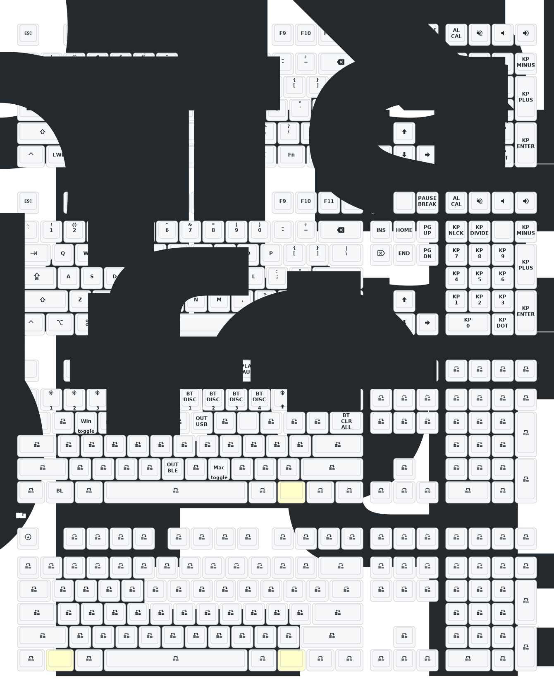

# 更新
- 2026/2/9 因zmk更新，使用新代码编译错误，此为旧版本v0.2存档备用
- 2025/11/12 键盘名称改为MX6.0 BLE,同时增加WIN/MAC配列(FN+W/M)
- 2025/9/27 增加解锁Studio键（Fn+ESC）及Bootloader键（Fn+LWin+ESC）
- 2025/6/26 增加有线蓝牙切换按键Fn+U/B/T
- 2025/6/24 增加Zmk-Studio支持
- 2025/6/12 主控为nrfmicro_13，配列为CHERRY MX6.0
  
# 键位图

